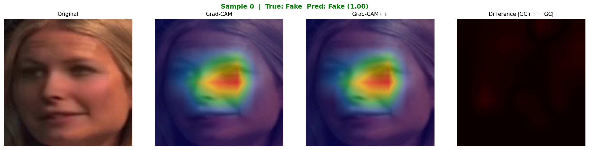
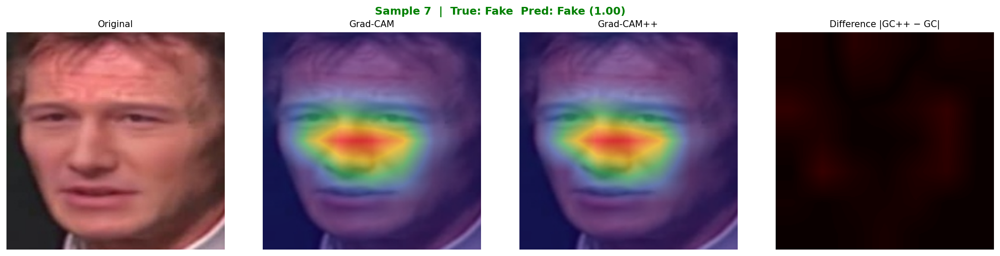
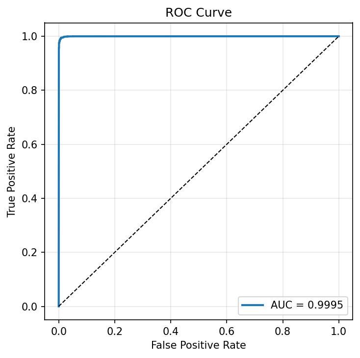
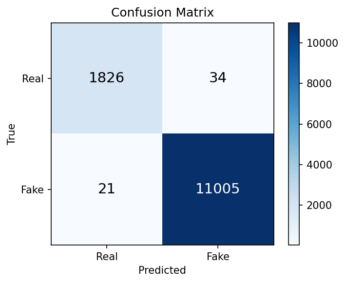
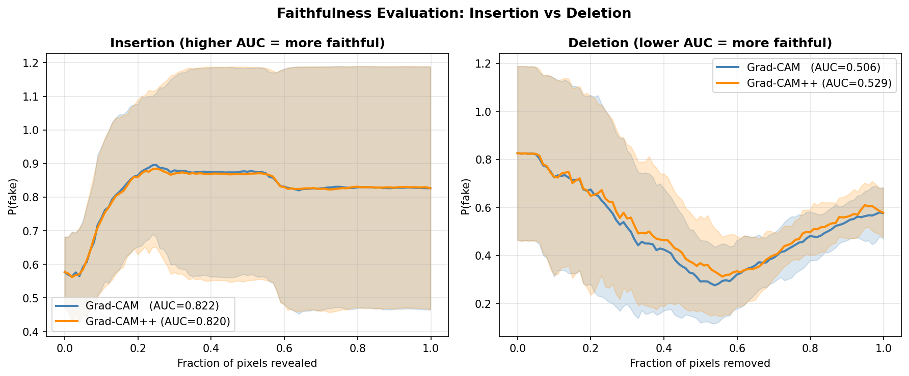

<div align="center">

# 🎭 Explainable Deepfake Detection with Grad-CAM

### A deepfake detector that also shows you *where* it looked

**EfficientNet-B0 · Grad-CAM · Grad-CAM++ · Celeb-DF v2 · PyTorch**


[Results](#-results) · [Demo](#-what-the-model-sees) · [How It Works](#-how-it-works) · [Reproduce](#-reproduce) · [What I Learned](#-what-i-learned)

---

### 🏆 Headline Numbers

| Accuracy | AUC-ROC | F1-Score | Test Set |
|:---:|:---:|:---:|:---:|
| **99.57%** | **0.9995** | **99.75%** | 12,886 frames |

</div>

---

## 🎯 Why This Project

Most deepfake detectors just give you a label. Fake. Real. No reasoning. That works on a research leaderboard, but it's not good enough for anyone who actually has to act on the prediction.

If you're a journalist about to publish a clip, you want to point at the part of the face the model flagged. If you're a forensic analyst, you need something defensible in court. If you moderate content at scale, you need to know whether the system is catching real forgeries or just freaking out about JPEG compression.

So I built one that draws on the face. For every frame the model calls fake, you get a heatmap showing the regions the network actually used to make that call.

---

## 👁️ What the Model Sees

The heatmaps usually land on the parts of the face where GAN-based synthesis falls apart: face-swap seams, eye region blurring, jaw-hair edges, weird skin texture.


> *Original · Grad-CAM · Grad-CAM++ · Difference map. Red = strongest attribution.*


> *Another frame, focus on the eyes and jawline.*

---

## 🧠 How It Works

Three stages, end to end:

```
Celeb-DF videos
       ↓
   [MTCNN]  → face detection + 224×224 alignment
       ↓
   85,902 face crops
       ↓
[EfficientNet-B0]  ← fine-tuned for binary classification
       ↓
   REAL / FAKE verdict + confidence score
       ↓
[Grad-CAM / Grad-CAM++]  ← gradient-weighted saliency on last conv layer
       ↓
   Heatmap overlay localizing the artifact
       ↓
[Insertion / Deletion]  ← faithfulness evaluation
```

Classification and explanation share the same network, so the heatmap reflects what the model actually used, not a separate post-hoc model guessing at it.

---

## 📊 Results

### Classification Performance (Celeb-DF v2 test set)

| Metric | Value |
|:---|:---:|
| Accuracy | **99.57%** |
| AUC-ROC | **0.9995** |
| Precision | 99.69% |
| Recall | 99.81% |
| F1-Score | 99.75% |

<p align="center">
  
  
</p>

### Faithfulness Comparison: Grad-CAM vs Grad-CAM++

This is the part I haven't seen done elsewhere on deepfake detection: an Insertion/Deletion evaluation comparing the two CAM variants head to head.

| Method | Insertion AUC ↑ | Deletion AUC ↓ |
|:---|:---:|:---:|
| Grad-CAM | **0.822** | 0.506 |
| Grad-CAM++ | 0.820 | **0.529** |



Neither method wins both. Grad-CAM has a tiny edge on Insertion, meaning its highlighted region alone is *almost enough* to trigger the fake call. Grad-CAM++ wins Deletion, meaning when you remove its highlighted region the model's confidence falls off a cliff faster. Different jobs want different things from this trade-off.

---

## 🛠️ Tech Stack

| Layer | Tools |
|:---|:---|
| **Deep Learning** | PyTorch, torchvision |
| **Model** | EfficientNet-B0 (ImageNet pre-trained, fine-tuned) |
| **Face Detection** | MTCNN (facenet-pytorch) |
| **Explainability** | Grad-CAM, Grad-CAM++ (implemented from scratch) |
| **Evaluation** | scikit-learn, Insertion/Deletion metrics |
| **Compute** | Kaggle Notebooks, T4 GPU |
| **Augmentation** | albumentations |

---

## 🚀 Reproduce

### Option 1: Kaggle (what I'd recommend)
1. Request Celeb-DF v2 access from [here](https://github.com/yuezunli/celeb-deepfakeforensics)
2. Upload the zip as a Kaggle dataset
3. Open `code/deepfake_gradcam_kaggle.ipynb` in Kaggle
4. Settings → Accelerator → **GPU T4 x2** · Internet → **On**
5. Run All. About 2 to 3 hours end to end.

### Option 2: Google Colab
1. Upload `Celeb-DF-v2.zip` to your Google Drive
2. Open `code/deepfake_gradcam.ipynb` in Colab with T4 GPU
3. Mount Drive, unzip, run all cells

### Requirements
```bash
pip install -r code/requirements.txt
```

---

## 📁 Project Structure

```
explainable-deepfake-detection/
├── code/
│   ├── deepfake_gradcam.ipynb         # Google Colab version
│   ├── deepfake_gradcam_kaggle.ipynb  # Kaggle version
│   └── requirements.txt
├── results/                            # Generated figures
│   ├── roc_curve.png
│   ├── confusion_matrix.png
│   ├── sample_*_comparison.png        # Grad-CAM heatmaps
│   ├── insertion_deletion_curves.png
│   └── training_curves.png
├── report/                             # LaTeX source + PDF
├── Report.pdf                          # Full academic report
└── README.md
```

---

## 💡 What I Learned

A few things stuck with me from building this:

A nice-looking heatmap isn't evidence of anything. Before I ran Insertion and Deletion I was happy with how the visualizations looked. After running them I realized some of those "obvious" highlights weren't actually load-bearing for the prediction. Faithfulness metrics force you to be honest.

Class imbalance is sneaky. Celeb-DF v2 is roughly six fakes for every real, and my first training run quietly collapsed to predicting "fake" on almost everything. Test accuracy looked good. The model was useless. WeightedRandomSampler fixed it.

Reproducibility is mostly a dependency problem. I lost most of an afternoon to numpy and OpenCV fighting each other on Colab before I gave up and moved to Kaggle, where the environment was actually stable. Now I pin everything.

And on the methods themselves: Grad-CAM++ is usually pitched as an improvement over Grad-CAM, but the trade-off I measured doesn't really support that framing. It depends on what you want the heatmap to do.

---

## 🔬 Future Work

- [ ] **Distribution shift:** train on Celeb-DF, test on FaceForensics++ / DFDC. Does the faithfulness gap still hold?
- [ ] **Vision Transformers:** swap EfficientNet for ViT, try attention rollout against Grad-CAM
- [ ] **Real-time inference:** quantize the model for edge deployment
- [ ] **Diffusion deepfakes:** the dataset is GAN-era. Diffusion outputs are a different distribution.

---

## 🔑 Keywords

`deepfake detection` · `explainable AI` · `XAI` · `Grad-CAM` · `Grad-CAM++` · `EfficientNet` · `face forgery detection` · `computer vision` · `PyTorch` · `Celeb-DF` · `interpretability` · `saliency maps` · `model faithfulness` · `insertion deletion metrics` · `convolutional neural networks` · `transfer learning` · `media forensics`

---

## 📄 Citation

```bibtex
@misc{salis2026deepfakegradcam,
  title  = {Deepfake Detection That Shows Its Work: Localizing Fake Facial Regions with Grad-CAM and Grad-CAM++},
  author = {Sal{\i}{\c{s}}, Baran},
  year   = {2026},
  note   = {AIN3002 Final Project, Bah{\c{c}}e{\c{s}}ehir University},
  url    = {https://github.com/YOUR_USERNAME/explainable-deepfake-detection}
}
```

---

## 📬 Contact

**Baran Salış** — AI & Software Engineering @ Bahçeşehir University

<a href="https://www.linkedin.com/in/baran-salis-197a13256/"></a>
<a href="mailto:barann.salis@gmail.com"></a>
<a href="https://github.com/Baransalis42"></a>

---

<div align="center">
<sub>Built with PyTorch · Trained on Kaggle · Explained with Grad-CAM</sub><br>
<sub>⭐ Star this repo if you find it useful.</sub>
</div>
